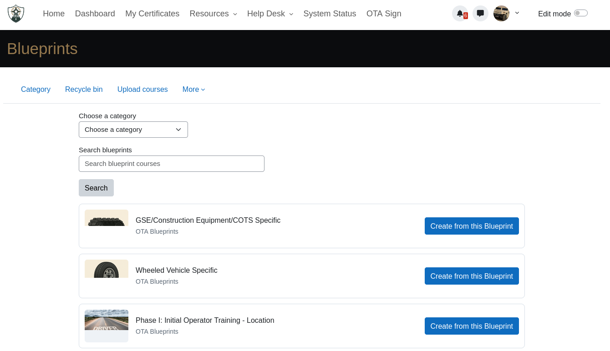
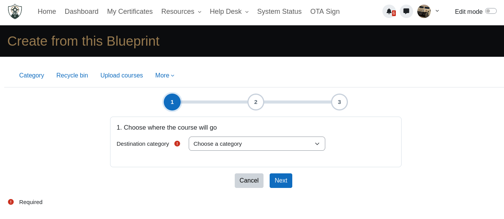

# Blueprints

A course blueprint system for Moodle that lets administrators designate courses as reusable templates. Users can browse, search, and clone blueprints into new empty courses via a guided 3-step wizard — no direct backup/restore required.

## Features

- **Blueprint Library** — Mark any Moodle course category as a blueprint repository; all courses within it (and its subcategories) become available as templates.
- **Browse & Search** — Card-based blueprint browser with category filtering and full-text search across course name, short name, and ID number.
- **Guided Course Creation** — A clean 3-step wizard walks users through selecting a destination category, confirming course names, and setting a start date.
- **Automatic User Data Stripping** — Cloned courses are completely clean — no enrolments, grades, roles, logs, comments, badges, or calendar events carry over.
- **Safe & Atomic** — If anything fails during the clone process, the partially created course is automatically deleted.
- **Seamless Integration** — A "Blueprints" button is automatically injected next to the "Create new course" button on course management pages, category pages, and the dashboard.
- **Event Support** — Fires a `course_created_from_blueprint` event on every successful clone for logging and integration.
- **Privacy Compliant** — The plugin stores no personal data.

## Screenshots

| | |
|---|---|
|  |  |

*Add your screenshots to the `screenshots/` folder to display them here.*

## Requirements

- Moodle 4.0 or later
- PHP 8.2 or later

## Installation

1. Download the plugin and extract it into your Moodle `local/` directory:
   ```
   cp -r moodle-local_blueprints /path/to/moodle/local/blueprints
   ```
2. Log in as an administrator and visit **Site administration > Notifications** to complete the installation.
3. Configure the plugin (see below).

## Configuration

Navigate to **Site administration > Plugins > Local plugins > Blueprints** and set:

| Setting | Description |
|---------|-------------|
| **Blueprint root category ID** | The numeric ID of the Moodle course category that serves as the root of your blueprint library. All courses in this category and its subcategories are shown as blueprints. |
| **Short name placeholder** | Placeholder text shown in the short name field during course creation (default: `Example: COURSE-101`). |

> **Tip:** You can find a category's ID by navigating to it in Moodle and checking the `id` parameter in the URL (e.g., `/course/category.php?id=3`).

## Usage

1. **Browse Blueprints** — Click the "Blueprints" button that appears on your dashboard, category pages, or the course management page. You'll see a searchable, filterable grid of all available blueprint courses.
2. **Select a Blueprint** — Use the category dropdown or search bar to find the blueprint you want. Click **Create from this Blueprint**.
3. **Step 1 — Choose Destination** — Select which category the new course should be created in.
4. **Step 2 — Confirm Names** — Review the course full name and enter a short name for the new course.
5. **Step 3 — Set Start Date** — Choose the course start date.
6. **Done** — The plugin creates a brand-new, empty course with all the structure, content, and settings from the blueprint. You're redirected straight into it.

## Capabilities

| Capability | Context | Default (Manager) | Default (Course Creator) |
|------------|---------|-------------------|--------------------------|
| `local/blueprints:createfromblueprint` | Course category | Allow | Allow |

This capability controls access to the blueprint browser and the clone operation. It is automatically available to any role that has `moodle/course:create`.

## How It Works

Under the hood, Blueprints uses Moodle's built-in backup and restore system:

1. The blueprint course is backed up (non-interactive, import mode) using the site admin's privileges.
2. All user-related settings are systematically disabled — enrolments, grades, roles, comments, logs, badges, calendars, and any setting containing `role`, `permission`, or `enrol`.
3. The backup is restored into a newly created empty course.
4. The new course is updated with the user-provided full name, short name, and start date.
5. If any error occurs, the partially created course is deleted automatically.

No database tables are created by the plugin. It operates entirely on Moodle's core `course` and `course_categories` tables.

## Events

The plugin fires the following event on every successful course creation:

| Event | Description |
|-------|-------------|
| `local_blueprints\event\course_created_from_blueprint` | Triggered after a course is successfully cloned from a blueprint. Contains the new course ID, the source blueprint ID, the destination category, and the privileged user ID used for the backup/restore. |

## Privacy

This plugin implements the `\core_privacy\local\metadata\null_provider` — it does not store any personal data.

## License

[GNU General Public License v3 or later](http://www.gnu.org/copyleft/gpl.html)

## Author

**Operator Training Academy**
[otancoic@operatortraining.academy](mailto:otancoic@operatortraining.academy)
